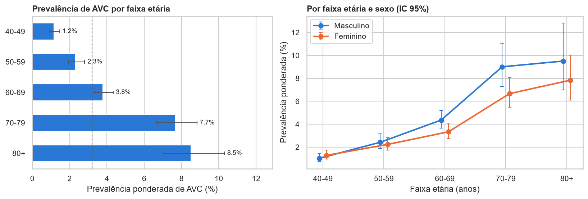
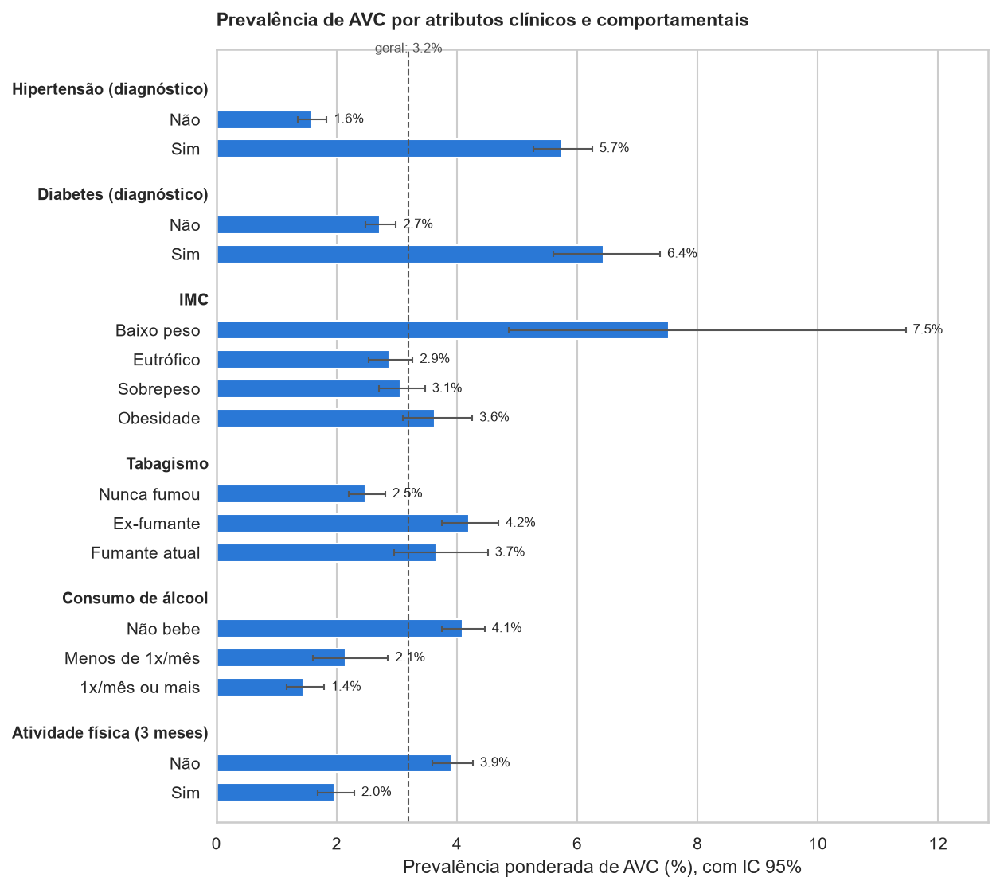

# Aplicação de Inteligência Artificial para Identificação de Fatores de Risco de AVC com Microdados da PNS 2019

**Luana Miho Yasuda, Luis Fernando de Mesquita Pereira, Richard Barbosa Sanches, Totti Ferreira Gomes, Gabriel Resende Menezes**

Faculdade de Computação e Informática – Universidade Presbiteriana Mackenzie (UPM)
Rua da Consolação, 930 – 01302-907 – São Paulo – SP – Brasil

10396439@mackenzista.com.br, 10410686@mackenzista.com.br, 10420179@mackenzista.com.br,
10428490@mackenzista.com.br, 10419003@mackenzista.com.br

---

**Abstract.** Stroke is one of the leading causes of death and acquired disability in Brazil, and most of its risk
factors are modifiable. This partial paper presents a project that applies supervised machine learning to microdata
from the 2019 Brazilian National Health Survey (PNS), restricted to individuals aged 40 or older, to classify the
self-reported medical diagnosis of stroke from demographic, clinical, behavioral and socioeconomic attributes.
Logistic Regression, Random Forest and XGBoost will be compared under stratified cross-validation, with
class-imbalance handling and metrics suited to rare events, and SHAP will be used to explain the most influential
factors. The project is aligned with SDG 3 (Good Health and Well-Being).

**Resumo.** O Acidente Vascular Cerebral (AVC) está entre as principais causas de morte e de incapacidade adquirida
no Brasil, e a maior parte de seus fatores de risco é modificável. Este artigo parcial apresenta um projeto que
aplica aprendizado de máquina supervisionado aos microdados da Pesquisa Nacional de Saúde (PNS) 2019, restritos à
população com 40 anos ou mais, para classificar o diagnóstico médico referido de AVC a partir de atributos
demográficos, clínicos, comportamentais e socioeconômicos. Serão comparados Regressão Logística, Random Forest e
XGBoost, com validação cruzada estratificada, tratamento do desbalanceamento de classes e métricas adequadas a
eventos raros, e a técnica SHAP será empregada para explicar os fatores mais influentes. O projeto está alinhado à
ODS 3 (Saúde e Bem-Estar).

## 1. Introdução

Este artigo parcial apresenta a proposta, a fundamentação teórica, a metodologia e os resultados parciais de um
projeto desenvolvido na disciplina de Inteligência Artificial, que aplica técnicas de aprendizado de máquina a um
problema real da área da saúde, alinhado ao Objetivo de Desenvolvimento Sustentável (ODS) 3 – Saúde e Bem-Estar
[ONU 2015]. A ODS 3 é contemplada na medida em que o projeto busca auxiliar na identificação de fatores associados ao
risco de AVC, contribuindo para ações preventivas e para a melhoria da qualidade de vida da população.

### 1.1. Contextualização

O Acidente Vascular Cerebral (AVC) figura entre as principais causas de morte e de incapacidade adquirida no Brasil
e no mundo, com impacto expressivo sobre a autonomia dos indivíduos acometidos, sobre suas famílias e sobre os
custos assistenciais do Sistema Único de Saúde (SUS) [Feigin et al. 2021]. Trata-se de um agravo cujos principais
fatores de risco, como a hipertensão arterial, o diabetes, o tabagismo, o sedentarismo e a obesidade, são
majoritariamente modificáveis, o que confere alto potencial às estratégias de prevenção primária
[O'Donnell et al. 2016].

No Brasil, a Pesquisa Nacional de Saúde (PNS), realizada pelo Instituto Brasileiro de Geografia e Estatística (IBGE)
em parceria com o Ministério da Saúde, constitui o inquérito domiciliar mais abrangente sobre as condições de saúde
da população, reunindo simultaneamente informações sobre morbidade referida, hábitos de vida, características
socioeconômicas e acesso a serviços de saúde [Stopa et al. 2020; IBGE 2020]. A disponibilidade pública desses
microdados abre a possibilidade de aplicar técnicas de aprendizado de máquina para identificar, de forma
sistemática, quais características se associam à ocorrência de AVC na população brasileira e em que magnitude.

### 1.2. Justificativa

Técnicas de aprendizado de máquina supervisionado são adequadas para analisar dados clínicos e pessoais já
rotulados, permitindo identificar padrões associados à ocorrência de AVC. O uso de modelos de classificação
possibilita estimar o risco a partir das características presentes no conjunto de dados, enquanto técnicas de
Inteligência Artificial Explicável (XAI), como o SHAP [Lundberg e Lee 2017], ajudam a compreender quais fatores mais
influenciam as previsões, tornando os resultados mais interpretáveis e úteis para a análise do problema. A escolha
de modelos baseados em árvores, como Random Forest e XGBoost, justifica-se por seu bom desempenho em dados tabulares
heterogêneos e pela compatibilidade com métodos eficientes de explicação.

### 1.3. Motivação

A escolha do tema se deve à importância da prevenção e da identificação precoce de fatores relacionados ao AVC. A
aplicação de IA pode contribuir para a análise de dados de forma mais eficiente, auxiliando na identificação de
padrões de risco em grande escala e apoiando estudos e ações de saúde pública voltados à prevenção. Além disso, o uso
de uma base nacional representativa permite discutir o problema a partir da realidade brasileira, e não apenas de
bases estrangeiras ou de conjuntos de dados de pequeno porte.

### 1.4. Objetivo

O objetivo geral do projeto é desenvolver um modelo de IA capaz de analisar dados clínicos e pessoais para
identificar padrões associados ao risco de ocorrência de AVC, utilizando técnicas de aprendizado de máquina
supervisionado e classificação de dados. Como objetivos específicos, pretende-se: (i) preparar e caracterizar a base
da PNS 2019 para a tarefa de classificação; (ii) treinar e comparar diferentes modelos de classificação sob um
protocolo experimental adequado a classes desbalanceadas; e (iii) aplicar técnicas de XAI para identificar os
atributos de maior influência nas previsões.

### 1.5. Contribuições esperadas

Espera-se que o projeto contribua para a identificação de padrões associados ao risco de AVC por meio da aplicação
de técnicas de IA, em diferentes dimensões: na compreensão do problema, ao formalizar a identificação de risco de AVC
como uma tarefa de classificação binária; nos dados, ao construir e caracterizar uma base analítica a partir dos
microdados da PNS; na modelagem e na experimentação, ao desenvolver e comparar modelos de classificação sob um
protocolo com validação cruzada e métricas apropriadas; na explicabilidade, ao investigar, com SHAP, quais
atributos mais influenciam as previsões; na reprodutibilidade, ao disponibilizar código e documentação em
repositório público; e na análise crítica, ao discutir limitações, vieses e possibilidades de evolução. Dessa forma,
o projeto poderá apoiar a compreensão dos principais fatores de risco e demonstrar o potencial da IA como ferramenta
de apoio à análise preventiva na área da saúde.

## 2. Fundamentação Teórica

### 2.1. Conceitos fundamentais

O aprendizado de máquina supervisionado consiste em induzir, a partir de exemplos rotulados, uma função que mapeia
atributos de entrada para uma variável-alvo. Quando a variável-alvo é categórica, a tarefa é denominada
classificação; neste projeto, trata-se de uma classificação binária, em que cada indivíduo é rotulado conforme a
presença ou ausência de diagnóstico médico referido de AVC.

Serão considerados três modelos de classificação. A Regressão Logística é um modelo linear generalizado que estima
a probabilidade de pertencimento à classe positiva e serve como linha de base interpretável. O Random Forest combina
um conjunto de árvores de decisão treinadas sobre amostras bootstrap e subconjuntos aleatórios de atributos,
reduzindo a variância do modelo [Breiman 2001]. O XGBoost é uma implementação eficiente de gradient boosting de
árvores, com regularização e tratamento nativo de valores ausentes, amplamente utilizada em dados tabulares
[Chen e Guestrin 2016].

Como o AVC é um evento de baixa prevalência, a base apresenta desbalanceamento de classes, situação em que a
acurácia se torna enganosa. Para lidar com esse problema, podem ser empregadas a ponderação de classes na função de
custo e técnicas de reamostragem, como o SMOTE, que gera exemplos sintéticos da classe minoritária
[Chawla et al. 2002; Lemaître et al. 2017]. Na avaliação, métricas como a área sob a curva ROC (ROC-AUC), a área sob
a curva precisão-revocação (PR-AUC), a revocação (sensibilidade), a precisão e o F1-score são mais informativas,
sendo a curva precisão-revocação especialmente indicada para bases desbalanceadas [Saito e Rehmsmeier 2015].

A Inteligência Artificial Explicável (XAI) reúne técnicas que tornam compreensíveis as decisões de modelos
complexos. O SHAP (SHapley Additive exPlanations) fundamenta-se nos valores de Shapley da teoria dos jogos
cooperativos para atribuir a cada atributo uma contribuição aditiva para a previsão individual, permitindo tanto
explicações locais (por indivíduo) quanto globais (importância média dos atributos) [Lundberg e Lee 2017].

### 2.2. Trabalhos relacionados

Khosla et al. (2010) propuseram uma abordagem integrada de aprendizado de máquina para predição de AVC com dados do
Cardiovascular Health Study, combinando seleção de atributos e modelos para dados censurados, e obtiveram
desempenho superior ao do modelo de riscos proporcionais de Cox tradicionalmente empregado. Wu e Fang (2020)
compararam regressão logística regularizada, máquinas de vetores de suporte e Random Forest para predição de AVC em
idosos chineses da coorte CHARLS, destacando a necessidade de técnicas de reamostragem para lidar com o
desbalanceamento de classes.

Dritsas e Trigka (2022) avaliaram diversos classificadores sobre uma base pública de predição de AVC, aplicando
SMOTE e obtendo os melhores resultados com um modelo de empilhamento (stacking); por se tratar de uma base de
pequeno porte e balanceada artificialmente, esse tipo de resultado reforça a importância de protocolos
experimentais que evitem superestimação do desempenho. Heo et al. (2019) mostraram que uma rede neural profunda
superou um escore clínico tradicional na predição do desfecho funcional de pacientes com AVC isquêmico agudo. No
contexto brasileiro, Bensenor et al. (2015) utilizaram a PNS 2013 para estimar a prevalência de AVC e da incapacidade
associada, identificando maior ocorrência entre idosos e em grupos de menor escolaridade, porém por meio de análise
estatística descritiva, sem modelos de aprendizado de máquina.

Diferentemente desses trabalhos, o presente projeto combina modelos de classificação e XAI sobre um inquérito
populacional brasileiro recente (PNS 2019), com atributos demográficos, clínicos, comportamentais e
socioeconômicos, e discute explicitamente as limitações decorrentes do desenho amostral e do caráter transversal
dos dados.

## 3. Metodologia e Resultados Esperados

### 3.1. Abordagem e etapas

A metodologia segue um fluxo inspirado no processo CRISP-DM, organizado nas seguintes etapas: (i) entendimento do
problema e formalização como tarefa de classificação binária; (ii) aquisição dos microdados da PNS 2019 diretamente do
portal do IBGE, com leitura do arquivo de largura fixa em Python; (iii) seleção de variáveis, recorte da amostra e preparação dos dados; (iv) análise
exploratória, com uso dos pesos amostrais para estimativa de prevalências; (v) modelagem em Python, com pandas,
scikit-learn [Pedregosa et al. 2011], xgboost e imbalanced-learn, comparando Regressão Logística (linha de base),
Random Forest e XGBoost; (vi) avaliação; (vii) explicabilidade com a biblioteca shap; e (viii) análise crítica dos
resultados e das limitações.

O protocolo experimental prevê a divisão estratificada da base em treino (80%) e teste (20%), preservando a
proporção de casos de AVC. No conjunto de treino, os hiperparâmetros serão ajustados por validação cruzada
estratificada com cinco partições. As etapas de imputação, codificação, padronização e balanceamento (ponderação de
classes ou SMOTE) serão encapsuladas em pipelines e ajustadas apenas nos dados de treino de cada partição, evitando
vazamento de informação. Os modelos serão comparados por PR-AUC, ROC-AUC, revocação, precisão, F1-score e matriz de
confusão, com ajuste do limiar de decisão para priorizar a sensibilidade. O conjunto de teste será utilizado uma
única vez, na avaliação final.

Como resultados esperados, prevê-se: um modelo com desempenho superior à linha de base em PR-AUC e revocação; um
ranking de atributos, obtido por SHAP, cuja coerência com a literatura epidemiológica (por exemplo, idade,
hipertensão e diabetes) possa ser discutida; e uma análise crítica das limitações, incluindo o fato de a PNS ser um
estudo transversal, o que caracteriza os resultados como associações e não como relações causais ou previsões
prospectivas.

### 3.2. Dataset

A base de dados utilizada corresponde aos microdados da Pesquisa Nacional de Saúde (PNS) 2019, produzidos pelo IBGE
em parceria com o Ministério da Saúde e disponibilizados publicamente no portal do IBGE, acompanhados de dicionário
de variáveis e questionário [IBGE 2020; Stopa et al. 2020]. Os microdados são disponibilizados de forma anonimizada,
sem informações que permitam a identificação direta dos respondentes.

A variável-alvo corresponde à resposta ao item do módulo de doenças crônicas referente a diagnóstico médico prévio
de AVC ou derrame, codificada como variável binária. Os atributos preditores estão organizados em quatro grupos,
apresentados na Tabela 1.

**Tabela 1. Grupos de atributos preditores selecionados da PNS 2019**

| Grupo | Atributos |
|---|---|
| Demográficos | Idade, sexo, cor/raça, região, situação urbana ou rural |
| Clínicos | Diagnóstico prévio de hipertensão e de diabetes, medidas antropométricas (peso, altura e IMC) |
| Comportamentais | Tabagismo, consumo de álcool, prática de atividade física |
| Socioeconômicos | Escolaridade, rendimento domiciliar, posse de plano de saúde |

A análise será restrita à população de 40 anos ou mais, faixa em que a ocorrência do agravo é epidemiologicamente
relevante. O recorte reduz a assimetria extrema entre as classes sem introduzir viés de conveniência e é adotado com
frequência em estudos que utilizam a mesma base. A PNS emprega amostragem complexa, com estratificação,
conglomerados e pesos amostrais distintos. Os pesos serão utilizados na etapa descritiva, para estimativa de
prevalências e caracterização da amostra; na etapa de modelagem, os modelos serão treinados sem ponderação, escolha
que será declarada e discutida como limitação metodológica do trabalho.

A análise exploratória compreenderá a estimativa da prevalência ponderada de AVC por faixa etária, sexo, região e
escolaridade; a distribuição dos atributos em cada classe; a quantificação de valores ausentes e de respostas do
tipo "não sabe" ou "ignorado"; e a verificação de correlações entre atributos. A preparação dos dados incluirá a
filtragem do recorte etário, a recodificação das categorias do dicionário do IBGE, o cálculo do Índice de Massa
Corporal (IMC), o tratamento de valores ausentes por imputação, a codificação one-hot das variáveis categóricas, a
padronização para o modelo linear e a exclusão de variáveis que constituam consequência do próprio AVC (por exemplo,
limitações decorrentes da doença), de modo a evitar vazamento de informação.

## 4. Resultados Parciais

### 4.1. Aspectos éticos e responsabilidade no uso da IA

O projeto utiliza exclusivamente dados públicos e anonimizados, com finalidade acadêmica, em consonância com os
princípios da Lei Geral de Proteção de Dados Pessoais [Brasil 2018]. Ainda assim, o tratamento de dados de saúde
exige cuidados: os microdados brutos não serão redistribuídos no repositório, que conterá apenas os scripts de
obtenção e processamento.

O modelo desenvolvido não se destina ao diagnóstico individual nem substitui a avaliação de profissionais de saúde;
seus resultados devem ser interpretados como apoio à compreensão de fatores de risco em nível populacional. Modelos
treinados sobre dados históricos podem reproduzir desigualdades presentes na sociedade [Obermeyer et al. 2019]; por
isso, o desempenho será analisado por subgrupos (sexo, cor/raça e região), e atributos sensíveis serão utilizados
apenas com justificativa epidemiológica e discutidos criticamente. O uso de XAI contribui para a transparência e
para a responsabilização, alinhando o projeto às diretrizes da Organização Mundial da Saúde para o uso ético da IA
em saúde [WHO 2021]. Por fim, serão explicitadas as limitações do estudo, como o caráter transversal e autorreferido
dos dados e o treinamento sem pesos amostrais.

### 4.2. Resultados parciais obtidos

Até o momento, foram concluídas as etapas de definição do problema e de sua formalização como tarefa de
classificação binária, a seleção da base de dados, o estudo do dicionário de variáveis e do questionário da PNS
2019, a definição da variável-alvo, dos atributos preditores e do recorte da amostra, bem como o desenho do
protocolo experimental descrito na Seção 3. Também foram concluídas a aquisição e a preparação dos microdados e a
análise exploratória.

**Aquisição e preparação.** Os microdados foram obtidos diretamente do FTP do IBGE e lidos em Python a partir
das posições definidas no programa de leitura oficial (input SAS). Como verificação, a prevalência ponderada de AVC referido entre adultos de 18 anos ou mais foi
estimada em 1,96% (cerca de 3,1 milhões de pessoas), valor coerente com a divulgação oficial da PNS 2019
[IBGE 2020]. A Tabela 2 apresenta o fluxo de seleção da amostra. A variável-alvo corresponde ao item Q068. Foram
excluídas as variáveis posteriores ao diagnóstico (idade no diagnóstico, cuidados recebidos e grau de limitação:
Q070, Q07208–Q07213 e Q073), por constituírem vazamento de informação.

**Tabela 2. Fluxo de seleção da amostra**

| Etapa | Registros |
|---|---:|
| Moradores no arquivo de microdados | 293.726 |
| Adultos com entrevista individual realizada | 90.846 |
| … com 40 anos ou mais e resposta válida sobre AVC | **54.987** |
| … dos quais com diagnóstico referido de AVC | **1.844** |

**Desbalanceamento.** Os casos representam 3,35% da amostra, uma razão de aproximadamente 29 negativos para cada
positivo. A prevalência ponderada de AVC na população de 40 anos ou mais é de **3,20% (IC 95%: 2,96%–3,46%)**, o
que corresponde a cerca de 2,9 milhões de pessoas. Um classificador trivial que sempre previsse "sem AVC" teria
acurácia próxima de 97%, o que confirma a escolha de PR-AUC, revocação e F1 como métricas principais.

**Valores ausentes.** Após o tratamento dos saltos do questionário (por exemplo, quem nunca mediu a glicemia não
responde à pergunta sobre diagnóstico de diabetes e foi considerado sem diagnóstico), apenas 89 registros (0,16%)
apresentam algum atributo ausente: peso, altura e IMC (0,12%), renda (0,03%) e cor/raça (0,01%). Respostas
"ignorado" são praticamente inexistentes nas variáveis selecionadas.

**Prevalência por subgrupos.** A Tabela 3 resume as estimativas ponderadas (com IC 95% calculados considerando
estratos e conglomerados) para os principais atributos.

**Tabela 3. Prevalência ponderada de AVC (%) por subgrupo, população de 40 anos ou mais – PNS 2019**

| Atributo | Categoria | Prevalência (IC 95%) |
|---|---|---|
| Faixa etária | 40–49 / 50–59 / 60–69 | 1,2 (0,9–1,5) / 2,3 (1,9–2,8) / 3,8 (3,3–4,3) |
| | 70–79 / 80+ | 7,7 (6,7–8,8) / 8,5 (7,0–10,3) |
| Sexo | Masculino / Feminino | 3,4 (3,1–3,8) / 3,0 (2,7–3,3) |
| Hipertensão | Sim / Não | 5,7 (5,3–6,2) / 1,6 (1,4–1,8) |
| Diabetes | Sim / Não | 6,4 (5,6–7,4) / 2,7 (2,5–3,0) |
| Tabagismo | Nunca / Ex-fumante / Atual | 2,5 (2,2–2,8) / 4,2 (3,7–4,7) / 3,7 (3,0–4,5) |
| Atividade física | Sim / Não | 2,0 (1,7–2,3) / 3,9 (3,6–4,3) |
| Escolaridade | Sem instrução/fund. incompleto | 4,6 (4,2–5,0) |
| | Superior completo | 1,4 (1,1–1,8) |
| Plano de saúde | Sim / Não | 2,3 (2,0–2,8) / 3,5 (3,3–3,9) |
| Região | Sul … Nordeste | 2,9 (2,4–3,4) … 3,5 (3,1–3,9) |

Os principais achados da análise exploratória são:

- **Idade** é o fator mais fortemente associado: a prevalência aumenta cerca de sete vezes entre as faixas de 40–49
  e de 80 anos ou mais. A mediana de idade é de 66 anos entre os casos e de 56 anos entre os não casos (Figura 1).
- Entre os **fatores clínicos**, a hipertensão (razão de prevalências bruta ≈ 3,6) e o diabetes (≈ 2,4) apresentam
  associação marcada. Cerca de 70% dos indivíduos com AVC referem hipertensão, contra 38% dos demais, o que está em
  consonância com a literatura [O'Donnell et al. 2016].
- Há um **gradiente socioeconômico** claro: a prevalência entre pessoas sem instrução ou com fundamental incompleto
  é mais de três vezes a observada entre quem tem superior completo, em linha com Bensenor et al. (2015). Parte
  desse gradiente, porém, decorre da estrutura etária, pois a escolaridade diminui com a idade (ρ = −0,29).
- Diferenças entre **regiões** e entre áreas urbanas e rurais não são estatisticamente distinguíveis. As categorias
  de cor/raça amarela e indígena têm poucos casos e intervalos amplos, o que exigirá cautela na análise por
  subgrupos.
- Alguns padrões evidenciam o **caráter transversal** da base: não consumir álcool e não praticar atividade física
  aparecem associados a *maior* prevalência de AVC, e ex-fumantes têm prevalência maior que fumantes atuais. Esses
  resultados são compatíveis com mudanças de hábito e limitações posteriores ao evento (causalidade reversa) e serão
  levados em conta na interpretação do SHAP.
- As **correlações** univariadas com o alvo são fracas (|ρ| ≤ 0,13; maiores para hipertensão e idade), o que é
  esperado para um desfecho raro e reforça a necessidade de modelos multivariados. Entre os preditores, as maiores
  correlações são moderadas (renda × plano de saúde, ρ = 0,48; escolaridade × renda, ρ = 0,43), sem
  multicolinearidade severa.

**Figura 1. Prevalência ponderada de AVC por faixa etária e por faixa etária e sexo (IC 95%).**

**Figura 2. Prevalência ponderada de AVC por atributos clínicos e comportamentais.**

As tabelas completas e as demais figuras (atributos socioeconômicos, distribuições por classe e matriz de
correlação) estão disponíveis na pasta `results/` do repositório e no notebook de análise exploratória.

As próximas etapas compreendem o treinamento e a comparação dos modelos, com imputação simples, codificação e
balanceamento encapsulados em pipelines, a aplicação do SHAP e a análise dos resultados por subgrupos.

### 4.3. Repositório GitHub

O código e a documentação do projeto estão disponíveis em:
<https://github.com/luisfernandomp/projeto-ia-predicao-risco-avc>. O repositório está organizado com um arquivo
README descrevendo o projeto e as instruções de execução, os módulos Python de obtenção e preparação dos
microdados, os notebooks de preparação e de análise exploratória, o arquivo de dependências (`requirements.txt`)
e uma pasta de resultados com as tabelas e figuras geradas.

## Referências

Bensenor, I. M., Goulart, A. C., Szwarcwald, C. L., Vieira, M. L. F. P., Malta, D. C. e Lotufo, P. A. (2015)
"Prevalence of stroke and associated disability in Brazil: National Health Survey – 2013", Arquivos de
Neuro-Psiquiatria, v. 73, n. 9, p. 746–750.

Brasil (2018) Lei nº 13.709, de 14 de agosto de 2018. Lei Geral de Proteção de Dados Pessoais (LGPD). Diário
Oficial da União, Brasília.

Breiman, L. (2001) "Random Forests", Machine Learning, v. 45, n. 1, p. 5–32.

Chawla, N. V., Bowyer, K. W., Hall, L. O. e Kegelmeyer, W. P. (2002) "SMOTE: Synthetic Minority Over-sampling
Technique", Journal of Artificial Intelligence Research, v. 16, p. 321–357.

Chen, T. e Guestrin, C. (2016) "XGBoost: A Scalable Tree Boosting System", In: Proceedings of the 22nd ACM SIGKDD
International Conference on Knowledge Discovery and Data Mining, p. 785–794.

Dritsas, E. e Trigka, M. (2022) "Stroke Risk Prediction with Machine Learning Techniques", Sensors, v. 22, n. 13,
4670.

Feigin, V. L. et al. (2021) "Global, regional, and national burden of stroke and its risk factors, 1990–2019: a
systematic analysis for the Global Burden of Disease Study 2019", The Lancet Neurology, v. 20, n. 10, p. 795–820.

Heo, J., Yoon, J. G., Park, H., Kim, Y. D., Nam, H. S. e Heo, J. H. (2019) "Machine Learning–Based Model for
Prediction of Outcomes in Acute Stroke", Stroke, v. 50, n. 5, p. 1263–1265.

IBGE – Instituto Brasileiro de Geografia e Estatística (2020) Pesquisa Nacional de Saúde 2019: percepção do estado
de saúde, estilos de vida, doenças crônicas e saúde bucal – Brasil e grandes regiões. Rio de Janeiro: IBGE.

Khosla, A., Cao, Y., Lin, C. C.-Y., Chiu, H.-K., Hu, J. e Lee, H. (2010) "An integrated machine learning approach to
stroke prediction", In: Proceedings of the 16th ACM SIGKDD International Conference on Knowledge Discovery and Data
Mining, p. 183–192.

Lemaître, G., Nogueira, F. e Aridas, C. K. (2017) "Imbalanced-learn: A Python Toolbox to Tackle the Curse of
Imbalanced Datasets in Machine Learning", Journal of Machine Learning Research, v. 18, n. 17, p. 1–5.

Lundberg, S. M. e Lee, S.-I. (2017) "A Unified Approach to Interpreting Model Predictions", In: Advances in Neural
Information Processing Systems 30 (NIPS 2017), p. 4765–4774.

O'Donnell, M. J. et al. (2016) "Global and regional effects of potentially modifiable risk factors associated with
acute stroke in 32 countries (INTERSTROKE): a case-control study", The Lancet, v. 388, n. 10046, p. 761–775.

Obermeyer, Z., Powers, B., Vogeli, C. e Mullainathan, S. (2019) "Dissecting racial bias in an algorithm used to
manage the health of populations", Science, v. 366, n. 6464, p. 447–453.

ONU – Organização das Nações Unidas (2015) Transformando Nosso Mundo: a Agenda 2030 para o Desenvolvimento
Sustentável. Nova York: ONU.

Pedregosa, F. et al. (2011) "Scikit-learn: Machine Learning in Python", Journal of Machine Learning Research, v. 12,
p. 2825–2830.

Saito, T. e Rehmsmeier, M. (2015) "The Precision-Recall Plot Is More Informative than the ROC Plot When Evaluating
Binary Classifiers on Imbalanced Datasets", PLoS ONE, v. 10, n. 3, e0118432.

Stopa, S. R. et al. (2020) "Pesquisa Nacional de Saúde 2019: histórico, métodos e perspectivas", Epidemiologia e
Serviços de Saúde, v. 29, n. 5, e2020315.

WHO – World Health Organization (2021) Ethics and Governance of Artificial Intelligence for Health: WHO Guidance.
Geneva: WHO.

Wu, Y. e Fang, Y. (2020) "Stroke Prediction with Machine Learning Methods among Older Chinese", International
Journal of Environmental Research and Public Health, v. 17, n. 6, 1828.
